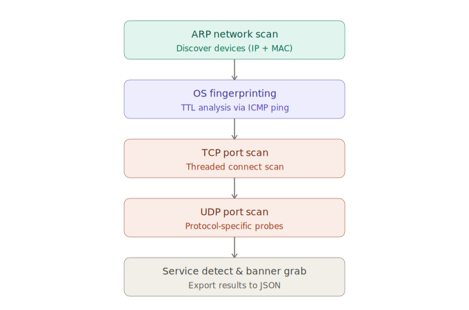

# 🔍 NetReconX


A multi-threaded network reconnaissance tool built using Python that performs **ARP-based device discovery**, **OS fingerprinting**, **TCP & UDP port scanning** with **service detection**, **banner grabbing**, and **automated CVE correlation**.

<br>

## 🎬 Demo


<br>

## 🚀 Features

| Feature | Description |
|---|---|
| 🔎 Network discovery | ARP scan to find active devices and collect IP/MAC addresses |
| 🧬 OS fingerprinting | TTL-based detection (Linux / Windows / Network device / Solaris) with confidence scoring |
| 🌐 TCP scanning | Multi-threaded connect scan with configurable port range and thread count |
| 📶 UDP scanning | Protocol-specific probes for DNS, NTP, SNMP, NetBIOS + generic fallback |
| 🏷️ Service detection | Maps 25+ TCP/UDP ports to service names |
| 📡 Banner grabbing | Extracts service banners for deeper inspection |
| 🛡️ CVE correlation | Parses product/version from banners and queries the NVD API for known CVEs (with severity & CVSS score) |
| 📊 Progress tracking | Real-time tqdm progress bars for TCP, UDP, and CVE lookups |
| 📝 Logging | Full scan activity logged to `scanner.log` |
| 📄 JSON export | Structured output with targets, OS guesses, open ports, and CVEs |
| 🔗 Flexible targeting | Single target or full network range |
| ✅ Unit tested | 17 tests covering core logic, no root required |

<br>

## 🧠 How It Works



<br>

## ⚙️ Installation

```bash
git clone https://github.com/tanay0505/NetReconX.git
cd NetReconX

python3 -m venv venv
source venv/bin/activate

pip install -r requirements.txt
```

<br>

## ▶️ Usage

### Scan a single target (TCP, ports 20–1000, with OS fingerprinting)
```bash
sudo venv/bin/python main.py --target 192.168.1.1 --start 20 --end 1000
```

### Scan local network (ARP discovery + OS fingerprint + port scan)
```bash
sudo venv/bin/python main.py --network 192.168.1.0/24 --start 20 --end 1000
```

### Include UDP scanning
```bash
sudo venv/bin/python main.py --target 192.168.1.1 --udp
```

### Custom UDP ports + timeout
```bash
sudo venv/bin/python main.py --target 192.168.1.1 --udp --udp-ports 53,123,161,500 --udp-timeout 1.5
```

### Look up CVEs for detected services
```bash
sudo venv/bin/python main.py --target scanme.nmap.org --cve
```

### Skip OS fingerprinting (faster scans)
```bash
sudo venv/bin/python main.py --target 192.168.1.1 --no-os-detect
```

### Tune thread count & timestamp output
```bash
sudo venv/bin/python main.py --target 192.168.1.1 --threads 200 --timestamp
```

<br>

### 🔧 CLI Flags

| Flag | Description | Default |
|---|---|---|
| `--target` | Single target IP or domain | — |
| `--network` | Network range for ARP scan (e.g. `192.168.1.0/24`) | — |
| `--start` / `--end` | TCP port range | `1` / `1000` |
| `--threads` | Max concurrent threads | `100` |
| `--udp` | Enable UDP scanning | off |
| `--udp-ports` | Comma-separated UDP ports | top 16 common ports |
| `--udp-timeout` | UDP probe timeout (seconds) | `2.0` |
| `--cve` | Look up known CVEs for detected service banners (NVD API) | off |
| `--cve-results` | Max CVEs to fetch per service/version | `5` |
| `--no-os-detect` | Skip OS fingerprinting | off |
| `--timestamp` | Add timestamp to output filename | off |

<br>

## 📄 Sample Output

```json
{
    "targets": [
        {
            "ip": "192.168.1.1",
            "mac": "AA:BB:CC:DD:EE:FF",
            "os_guess": "Linux / Android",
            "ttl": 64,
            "os_confidence": "high"
        }
    ],
    "open_ports": [
        {
            "target": "192.168.1.1",
            "mac": "AA:BB:CC:DD:EE:FF",
            "port": 22,
            "protocol": "tcp",
            "status": "open",
            "service": "SSH",
            "banner": "SSH-2.0-OpenSSH_6.6.1p1",
            "detected_product": "openssh",
            "detected_version": "6.6.1",
            "cves": [
                {
                    "id": "CVE-2014-2653",
                    "severity": "MEDIUM",
                    "score": 6.5,
                    "description": "ssh client did not properly verify host keys..."
                }
            ]
        },
        {
            "target": "192.168.1.1",
            "port": 53,
            "protocol": "udp",
            "status": "open",
            "service": "DNS",
            "response": "DNS reply (answers=1)"
        }
    ]
}
```

<br>


## 📦 Project Structure

```
.
├── main.py
├── scanner/
│   ├── core.py           # TCP connect scanning
│   ├── udp.py            # UDP scanning with protocol probes
│   ├── network.py        # ARP-based network discovery
│   ├── os_detect.py      # TTL-based OS fingerprinting
│   ├── banner.py         # Banner grabbing
│   ├── cve.py            # Banner parsing + NVD CVE lookup
│   ├── utils.py          # Service name mappings
│   └── logger.py         # Logging setup
├── tests/
│   └── test_scanner.py
├── docs/
│   ├── demo.gif
│   └── architecture.svg
├── results/              # JSON scan output (auto-created)
├── requirements.txt
└── README.md
```

<br>

## 🛠️ Tech Stack

- Python 3
- Socket Programming
- Concurrent.futures.ThreadPoolExecutor
- Scapy (ARP scanning, ICMP/UDP probes, OS fingerprinting)
- Requests (NVD CVE API)
- argparse (CLI interface)
- tqdm (progress bars)
- pytest (unit testing)
- logging

<br>

## ⚠️ Disclaimer

This tool is intended for **educational and authorized testing purposes only**.
Do not use it on networks or systems without proper permission.
